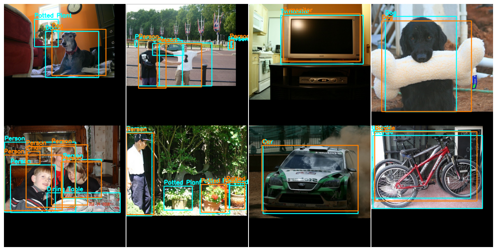

# Object Detection with KerasCV API

---

## ⚠️ API is still experimental ⚠️

---

# Background

- 1.5~ years ago I wrote a few object detection pipelines
- user experience was not good
- many issues (format mismatch, NaN loss, etc)

---

# Key painpoints

- bounding box formats were hard to manage
- data augmentation
- image shape management
- inherent ragged-ness of bounding boxes
- metric evaluation

---

# Feature Highlights

- TPU compatibility
- Train time COCO metric evaluation
- Native support for ragged bounding box inputs
- Easy, composable bounding box augmentations

---

# API Highlights

- Explicit bounding box formats
- Highly modular
- Ragged native preprocessing and augmentation layers
- Readable implementations

---

```python
# What format should the bounding boxes be in?
shear = layers.RandomShear(
  factor=0.1,
)
```

---

```python
shear = layers.RandomShear(
  factor=0.1,
  # bounding box format is explicit
  bounding_box_format='xywh'
)
```

---

#### This is consistent across all KerasCV object detection components!

---


##### Assembling an Augmentation Pipeline

```python
# images are ragged
# bounding box correctly augmented
augmenter = [
  layers.RandomFlip(bounding_box_format='xywh'),
  layers.RandomAspectRatio(factor=(0.9, 1.1)),
  layers.JitteredResize(
    target_size=(640, 640),
    scale_factor=(0.8, 1.35),
    bounding_box_format='xywh'
  ),
  layers.MixUp()
]

inputs = {
  "images": images,
  "bounding_boxes": boxes
}
augmenter(inputs)
```

---

##### Constructing a Model

```python
model = keras_cv.models.RetinaNet(
    # number of classes to be used in box classification
    classes=20,
    # For more info on supported bounding box formats, visit
    # https://keras.io/api/keras_cv/bounding_box/
    bounding_box_format="xywh",
    # KerasCV offers a set of pre-configured backbones
    backbone="resnet50",
    # Each backbone comes with multiple pre-trained weights
    # These weights match the weights available in the `keras_cv.model` class.
    backbone_weights="imagenet",
    # include_rescaling tells the model whether your input images are in the default
    # pixel range (0, 255) or if you have already rescaled your inputs to the range
    # (0, 1).  In our case, we feed our model images with inputs in the range (0, 255).
    include_rescaling=True,
)
# Fine-tuning a RetinaNet is as simple as setting backbone.trainable = False
model.backbone.trainable = False
```

---

##### Create Metrics

```python
metrics = [
    keras_cv.metrics.COCOMeanAveragePrecision(
        class_ids=range(20),
        bounding_box_format="xywh",
        name="Mean Average Precision",
    ),
    keras_cv.metrics.COCORecall(
        class_ids=range(20),
        bounding_box_format="xywh",
        max_detections=100,
        name="Recall",
    ),
]
```

---

##### Compile your model

```python
model.compile(
    classification_loss='focal',
    box_loss='smooth_l1',
    optimizer=tf.optimizers.SGD(global_clipnorm=10.0),
    metrics=metrics,
)
```

---

## Model Saving

```python
model.save_weights('my-weights.h5')
# Or
model.save('my-model.saved_model/')
# Or
model.save('my-weights.h5')
# Or
callbacks.ModelCheckpoint('my-weights.h5', save_weights_only=True)
```
---

## Inference

```python
model.load_weights('my-weights.h5')
y_pred = model.predict(images)
```

---



---

# [Demo Colab Notebook](https://colab.research.google.com/drive/1FXF4kT6WNymY5IvBBhkamdFF5NG5C0K3?usp=sharing)
