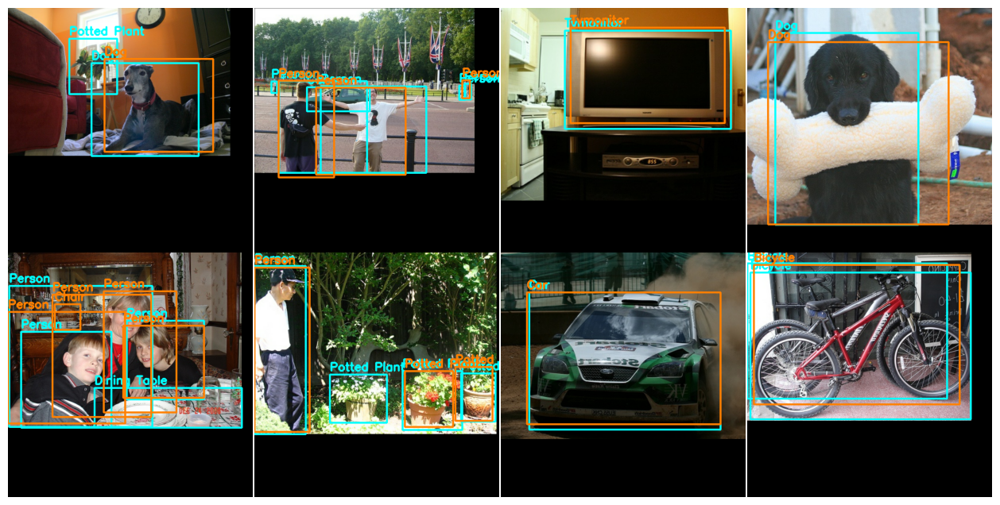

# KerasCV's Object Detection API

These slides contain a high level overview of KerasCV's Object Detection API.

Quick links:

- [Live slides](https://lukewood.github.io/od-api-slides/)
- [Demo colab](https://colab.research.google.com/drive/1FXF4kT6WNymY5IvBBhkamdFF5NG5C0K3?usp=sharing)
- [YouTube presentation](https://www.youtube.com/watch?v=exHKcj5_kQw&t=9330s)
